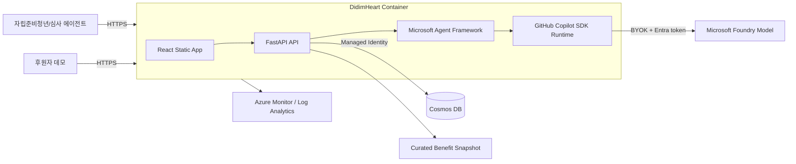

# 디딤하트(DidimHeart) 기술 요구사항 문서

| 항목 | 내용 |
|---|---|
| 버전 | 1.0 |
| 상태 | Hackathon MVP |
| 작성 기준일 | 2026-08-22 |
| 배포 목표 | Azure Container Apps |
| 주요 언어 | Python 3.11, TypeScript |

## 1. 기술 목표

이 설계는 맞다톤의 필수 기술을 형식적으로 붙이는 것이 아니라, 개인화 추천과 실행 계획이라는 핵심 경로에 깊게 통합하는 것을 목표로 한다.

1. GitHub Copilot SDK를 모델 세션, 스트리밍, 도구 호출에 사용한다.
2. Microsoft Agent Framework로 역할이 분리된 에이전트와 워크플로를 구성한다.
3. Azure에서 비밀값 없이 Managed Identity로 모델과 데이터에 접근한다.
4. 공개 게스트가 3분 안에 전체 골든 패스를 실행할 수 있게 한다.
5. 구조화 출력, 출처 검증, 멱등 원장으로 AI 환각과 중복 적립을 막는다.
6. 한 컨테이너와 최소 Azure 리소스로 5시간 30분 내 배포 가능한 범위를 유지한다.

## 2. 기술 스택

| 계층 | 선택 | 이유 |
|---|---|---|
| UI | React, TypeScript, Vite | 빠른 구현, 반응형 컴포넌트, 타입 안전성 |
| API | FastAPI, Pydantic (Python 3.11) | Python MAF 통합, 구조화 검증, SSE 구현 용이. Python 3.10은 `agent-framework-github-copilot`와 비호환이라 3.11로 고정 |
| AI SDK | `github-copilot-sdk` | 필수 기술, 세션·스트리밍·도구 호출 |
| Agent | `agent-framework-github-copilot` | Copilot SDK를 MAF 에이전트 공급자로 사용 |
| 모델 | Microsoft Foundry 배포 모델 | Azure Managed Identity 기반 BYOK |
| 저장소 | Azure Cosmos DB for NoSQL | 서버리스, JSON 모델, 원장 저장 |
| 호스팅 | Azure Container Apps | 공개 HTTPS, 자동 확장, 원본 Azure URL |
| 관찰 | OpenTelemetry, Azure Monitor, Log Analytics | 에이전트·도구·API 지연과 오류 추적 |
| IaC | Bicep + `azd` | 반복 가능한 Azure 배포 |
| 테스트 | pytest, Vitest, Playwright | 도메인·UI·E2E 분리 |

## 3. 시스템 컨텍스트



### 배포 단순화

- React를 빌드한 뒤 FastAPI의 정적 파일로 제공한다.
- API와 Copilot SDK 런타임을 같은 컨테이너에 둔다.
- 백엔드에서 SDK가 번들 런타임을 관리하게 해 별도 공개 CLI 포트를 만들지 않는다.
- 트래픽이 커지면 Copilot CLI headless 서버를 별도 사이드카/서비스로 분리하지만 MVP에는 적용하지 않는다.

## 4. 컴포넌트

### 4.1 Web UI

책임:

- 게스트 세션 생성과 최소 프로필 입력
- 추천 결과 렌더링과 진행 단계 표시(P0: 단일 응답, P1: SSE)
- 혜택 상세·비교
- 계획 초안 확인·수정·저장
- 진행 단계 완료
- 하트 원장과 후원 임팩트 표시

금지:

- 브라우저에서 모델 API 직접 호출
- 비밀값 보관
- 하트 잔액 계산을 클라이언트 값으로 신뢰

### 4.2 FastAPI

책임:

- 입력 검증과 세션 경계
- 혜택 조회·사전 필터
- MAF 워크플로 실행
- 구조화 출력 후검증
- 계획 저장과 완료 처리
- 하트 원장 멱등 기록
- 상태·관찰 API

### 4.3 Benefit Catalog

MVP에서는 `data/benefits.seed.json`을 애플리케이션 시작 시 Cosmos DB에 upsert한다. 동일한 `sourceId`와 `verifiedAt`이면 재삽입하지 않는다.

필수 데이터:

```json
{
  "id": "ncrc-self-reliance-allowance",
  "title": "자립수당",
  "provider": "보건복지부",
  "category": "생활",
  "regions": ["ALL"],
  "age": {"min": 18, "max": null},
  "eligibilityText": "공식 원문의 지원 대상 요약",
  "benefitText": "지원 내용",
  "applicationSteps": ["공식 신청 단계"],
  "requiredDocuments": ["확인된 준비서류"],
  "deadline": null,
  "sourceUrl": "https://...",
  "sourceAgency": "보건복지부",
  "verifiedAt": "2026-08-22",
  "status": "active"
}
```

금액과 조건은 조사 시점에 변할 수 있으므로 코드에 자연어로 중복 하드코딩하지 않는다.

### 4.4 Agent Runtime

`GitHubCopilotAgent`를 사용해 Copilot SDK를 MAF의 에이전트 공급자로 등록한다.

개념 코드:

```python
from agent_framework.github import GitHubCopilotAgent, GitHubCopilotOptions

agent_options: GitHubCopilotOptions = {
    "model": settings.foundry_model,
    "provider": foundry_provider,
    "streaming": True,
}
matcher = GitHubCopilotAgent(
    name="BenefitMatcherAgent",
    instructions=MATCHER_INSTRUCTIONS,
    default_options=agent_options,
    tools=[
        search_benefits,
        get_benefit_detail,
        compare_benefits,
        get_source_metadata,
    ],
)
```

`GitHubCopilotOptions.provider`는 Copilot SDK의 세션 `ProviderConfig`를 그대로 전달한다. 구현 시작 시 이 조합으로 실제 모델 응답과 도구 호출이 되는지 먼저 스파이크 테스트하고, 성공한 패키지 버전을 lock file에 고정한다.

## 5. 에이전트 설계

### 5.1 BenefitMatcherAgent

입력:

- 정규화된 사용자 프로필
- 사용자의 자연어 목표

도구:

- `search_benefits`
- `get_benefit_detail`
- `compare_benefits`
- `get_source_metadata`

출력:

- `RecommendationResponse` JSON

동작:

1. 서버가 연령, 지역, 상태, 마감일을 결정론적으로 필터링한다.
2. 에이전트가 최대 20개 후보에서 문제 적합도와 실행 가능성을 평가한다.
3. 각 추천에 일치 근거와 불확실 조건을 분리한다.
4. 출처와 확인일을 포함해 최대 3개만 반환한다.
5. 서버가 ID, URL, 날짜를 카탈로그와 대조한다.

### 5.2 ActionPlannerAgent

입력:

- 검증된 혜택 상세
- 사용자에게 공개 가능한 프로필 일부

도구:

- `get_benefit_detail`
- `get_source_metadata`

출력:

- `ActionPlanDraft` JSON

동작:

1. 원문 신청 단계와 준비서류를 읽는다.
2. 단계별 행동, 예상시간, 마감일을 구조화한다.
3. 확인할 수 없는 항목은 `uncertainties`에 넣는다.
4. 사용자가 확인한 후 일반 서비스 계층이 저장한다.

### 5.3 MAF 워크플로

추천과 계획을 매 요청마다 모두 실행하지 않는다.

```text
프로필 저장
  → 결정론적 후보 필터
  → BenefitMatcherAgent
  → RecommendationValidator
  → 사용자 선택/확인
  → ActionPlannerAgent
  → PlanValidator
  → 사용자 수정/저장
```

이 구조는 에이전트 수를 늘리는 대신 역할, 도구, 검증, 사용자 승인 깊이를 보여준다.

## 6. 도구 계약

### `search_benefits`

```python
async def search_benefits(
    region: str,
    age: int | None,
    categories: list[str],
    self_reliance_stage: str,
    limit: int = 20,
) -> list[BenefitSummary]:
    ...
```

- 읽기 전용이다.
- `limit`은 1~20으로 제한한다.
- 마감된 혜택은 기본 제외한다.
- 쿼리 문자열을 직접 DB 쿼리로 연결하지 않는다.

### `get_benefit_detail`

```python
async def get_benefit_detail(benefit_id: str) -> BenefitDetail:
    ...
```

- 저장소에 존재하는 ID만 허용한다.
- 내부 메모나 비공개 필드는 반환하지 않는다.

### `compare_benefits`

```python
async def compare_benefits(
    benefit_ids: list[str],
    profile: PublicProfile,
) -> list[BenefitComparison]:
    ...
```

- ID는 최대 3개다.
- 규칙으로 계산 가능한 차이는 도구가 계산하고 AI에게 맡기지 않는다.

### `get_source_metadata`

```python
async def get_source_metadata(benefit_id: str) -> SourceMetadata:
    ...
```

- `sourceUrl`, `sourceAgency`, `verifiedAt`을 반환한다.

## 7. 구조화 스키마

### 7.1 Profile

```python
class Profile(BaseModel):
    age_band: Literal["under_18", "18_24", "25_29", "30_34", "35_plus"]
    region: RegionCode
    self_reliance_stage: Literal[
        "before_exit", "within_1_year", "within_5_years", "general_youth"
    ]
    interests: list[BenefitCategory] = Field(min_length=1, max_length=3)
    work_study_status: WorkStudyStatus
    urgent_need: BenefitCategory
    income_band: IncomeBand | None = None
```

### 7.2 Recommendation

```python
class Recommendation(BaseModel):
    benefit_id: str
    fit: Literal["high", "medium", "low"]
    reasons: list[str] = Field(min_length=1, max_length=4)
    uncertainties: list[str] = Field(max_length=4)
    next_action: str
    source_url: HttpUrl
    verified_at: date
```

### 7.3 Action Plan

```python
class ActionStep(BaseModel):
    id: str
    title: str
    description: str
    estimated_minutes: int = Field(ge=1, le=240)
    order: int

class ActionPlan(BaseModel):
    id: str
    session_id: str
    benefit_id: str
    title: str
    deadline: date | None
    required_documents: list[str]
    steps: list[ActionStep] = Field(min_length=1, max_length=10)
    uncertainties: list[str]
    status: Literal["todo", "in_progress", "completed"]
```

### 7.4 Heart Ledger

```python
class HeartTransaction(BaseModel):
    id: str
    session_id: str
    plan_id: str
    step_id: str
    type: Literal["earn", "reversal", "sponsor_allocation_demo"]
    amount: int
    reason: str
    idempotency_key: str
    created_at: datetime
```

잔액은 `SUM(earn + sponsor_allocation_demo - reversal)`로 계산한다. 별도 잔액 필드를 진실의 원천으로 사용하지 않는다.

AI 출력에는 보상 규칙이나 하트 수량을 포함하지 않는다. 서버의 `HeartPolicy`가 계획별 첫 3개 단계에 단계당 10하트를 부여하고 계획별 최대 30하트로 제한한다.

## 8. API 설계

| Method | Path | 설명 |
|---|---|---|
| GET | `/healthz` | 프로세스 상태 |
| GET | `/readyz` | 요청 처리에 필요한 Cosmos DB 준비 상태 |
| GET | `/status/ai` | 비차단 AI 런타임·모델 상태 |
| POST | `/api/v1/demo-sessions` | 게스트 세션 생성 |
| PUT | `/api/v1/demo-sessions/{id}/profile` | 프로필 저장 |
| POST | `/api/v1/recommendations` | 추천 생성(P0, 단일 JSON 응답) |
| POST | `/api/v1/recommendations/stream` | 동일 입력의 SSE 스트림(P1) |
| GET | `/api/v1/benefits/{id}` | 혜택 상세 |
| POST | `/api/v1/benefits/compare` | 혜택 비교 |
| POST | `/api/v1/plans/draft` | AI 계획 초안 |
| POST | `/api/v1/plans` | 확인된 계획 저장 |
| GET | `/api/v1/plans` | 세션 계획 목록 |
| POST | `/api/v1/plans/{planId}/steps/{stepId}/complete` | 단계 완료와 하트 적립 |
| POST | `/api/v1/plans/{planId}/steps/{stepId}/reopen` | 완료 취소와 보정 거래 |
| GET | `/api/v1/hearts/ledger` | 하트 원장 |
| GET | `/api/v1/impact` | 비식별 집계 임팩트 |

### SSE 이벤트

두 엔드포인트는 동일한 워크플로와 동일한 검증기를 공유한다. `/api/v1/recommendations`가 P0 경로이며 최종 검증된 결과만 한 번에 반환한다. SSE는 같은 결과에 진행 단계를 덧붙이는 P1 업그레이드이므로, SSE가 완성되지 않아도 골든 패스는 동작해야 한다.

```text
event: status
data: {"stage":"searching","message":"조건에 맞는 혜택을 찾고 있어요."}

event: tool
data: {"name":"search_benefits","state":"completed","count":12}

event: recommendation
data: {"benefitId":"...","fit":"high", ...}

event: done
data: {"count":3}
```

내부 프롬프트, 토큰, 스택 트레이스는 브라우저에 보내지 않는다.

## 9. Cosmos DB 설계

단일 데이터베이스 `didimheart`에 다음 컨테이너를 사용한다.

| 컨테이너 | 파티션 키 | 용도 |
|---|---|---|
| `benefits` | `/category` | 혜택 카탈로그 |
| `sessions` | `/id` | 게스트 프로필과 TTL |
| `plans` | `/sessionId` | 실행 계획 |
| `heartLedger` | `/sessionId` | 불변 하트 거래 |

### 멱등성

- 완료 요청의 `idempotency_key`는 `{sessionId}:{planId}:{stepId}:complete`로 만든다.
- Cosmos DB unique key 또는 transactional batch로 동일 키 중복을 거부한다.
- 계획 상태 갱신과 원장 삽입은 동일 파티션에서 transactional batch로 수행한다.
- 완료 취소는 기존 거래를 삭제하지 않고 `reversal` 거래를 추가한다.

### 보존

- `sessions`: TTL 24시간
- `plans`, `heartLedger`: 데모 환경에서는 TTL 7일
- `benefits`: TTL 없음

## 10. GitHub Copilot SDK 및 MAF 연결

### 10.1 패키지

```text
github-copilot-sdk
agent-framework-github-copilot
azure-identity
```

정확한 버전은 구현 시작 시 잠그고 lock file에 커밋한다.

### 10.2 Azure Managed Identity

GitHub Copilot SDK의 공식 BYOK 구성을 사용한다.

```python
from azure.identity.aio import DefaultAzureCredential
from copilot.session import ProviderConfig

credential = DefaultAzureCredential(require_envvar=True)

async def get_bearer_token(_args) -> str:
    token = await credential.get_token("https://ai.azure.com/.default")
    return token.token

provider = ProviderConfig(
    type="openai",
    base_url=f"{foundry_url.rstrip('/')}/openai/v1/",
    bearer_token_provider=get_bearer_token,
    wire_api="responses",
)

agent_options: GitHubCopilotOptions = {
    "model": os.environ["FOUNDRY_MODEL"],
    "provider": provider,
    "streaming": True,
}

matcher = GitHubCopilotAgent(
    name="BenefitMatcherAgent",
    instructions=MATCHER_INSTRUCTIONS,
    default_options=agent_options,
    tools=[search_benefits, get_benefit_detail, compare_benefits, get_source_metadata],
)
```

환경 변수:

| 이름 | 로컬 | Azure |
|---|---|---|
| `AZURE_TOKEN_CREDENTIALS` | `AzureCliCredential` | `ManagedIdentityCredential` |
| `FOUNDRY_RESOURCE_URL` | Foundry 리소스 URL | 동일 |
| `FOUNDRY_MODEL` | 배포 모델명 | 동일 |
| `COSMOS_ENDPOINT` | Cosmos URL | 동일 |

API 키는 사용하지 않는다. Managed Identity에 필요한 최소 역할만 부여한다.

### 10.3 권한 처리

- AI 도구는 모두 읽기 전용이다.
- `GitHubCopilotAgent`의 기본 permission handler는 **deny-all**이다. 편의를 위해 `PermissionHandler.approve_all`로 열지 않는다.
- **실측 동작**: MAF 함수 도구는 실행 시 `PermissionRequestCustomTool`로 게이트되어 deny-all 기본값에 막힌다. 따라서 우리 4개 읽기 전용 도구도 명시적으로 승인해 주지 않으면 "Permission denied"로 실패한다. `approval_mode`를 생략해도 게이트를 우회하지 못한다.
- 이를 위해 `GitHubCopilotOptions`에 `on_permission_request` 핸들러를 설치한다. 핸들러는 요청 도구 이름이 **허용 목록(정확히 일치)** 에 있을 때만 `PermissionDecisionApproveOnce()`로 승인하고, 그 외에는 `PermissionDecisionUserNotAvailable()`로 거부한다.
- 허용 목록은 정확히 `{"search_benefits", "get_benefit_detail", "compare_benefits", "get_source_metadata"}` 네 개뿐이다. 이름이 목록에 없으면(셸·파일 쓰기·임의 URL·MCP 등 모든 요청 포함) **거부가 기본값**이다.
- 결정 클래스는 `copilot.generated.rpc`(`PermissionDecisionApproveOnce`, `PermissionDecisionUserNotAvailable`), 요청 클래스는 `copilot.session_events`(`PermissionRequestCustomTool`)에서 가져온다.
- 향후 쓰기 도구를 추가하더라도 자동 승인 목록에 절대 넣지 않고, 별도의 사용자 확인 흐름을 통해서만 처리한다.

## 11. 추천 정확도와 환각 방지

### 입력 방어

- 사용자 입력 길이: 필드당 300자 이하
- 자연어 질문: 1,000자 이하
- HTML 제거 및 제어문자 정규화
- 외부 정책 텍스트는 `<untrusted_policy_data>` 경계로 감싼다.

### 출력 방어

1. Pydantic 스키마 검증
2. 추천 `benefit_id` 존재 여부 확인
3. `source_url`, `verified_at`을 DB 값으로 덮어써 신뢰 경계 유지
4. 금액·날짜가 원문 값과 다르면 결과 거부
5. 실패 시 한 번만 재시도
6. 두 번째 실패 시 오류를 반환하고 가짜 추천을 생성하지 않음

### 정책

- "신청 가능성이 높습니다"는 허용한다.
- "반드시 받을 수 있습니다"는 금지한다.
- 자해, 긴급주거, 폭력 등 위기 표현이 감지되면 AI 추론보다 공식 긴급 연락처를 우선 노출한다. MVP에서는 진단이나 상담을 제공하지 않는다.

## 12. 보안

### 위협과 대응

| 위협 | 대응 |
|---|---|
| 프롬프트 인젝션 | 외부 텍스트를 비신뢰 데이터로 구분, 시스템 프롬프트 비공개, 도구 allowlist |
| 임의 도구 실행 | 읽기 전용 앱 도구만 등록, 셸·파일·URL 도구 비활성화 |
| 하트 중복 적립 | 서버 규칙, 멱등 키, transactional batch |
| 세션 탈취 | 128-bit 랜덤 ID, SameSite 쿠키, 짧은 TTL |
| 비밀 유출 | Managed Identity, 로그 redaction, 프런트엔드 환경변수 금지 |
| 과도한 비용 | 요청 rate limit, 후보 20개, 최대 출력 토큰, timeout |
| 개인정보 노출 | 직접 식별정보 미수집, 집계 임팩트, 프롬프트 미로깅 |

### HTTP

- HTTPS only
- HSTS
- `Content-Security-Policy`
- `X-Content-Type-Options: nosniff`
- `Referrer-Policy: strict-origin-when-cross-origin`
- CORS는 동일 배포 원본만 허용

## 13. 오류 처리

표준 오류:

```json
{
  "error": {
    "code": "AI_TIMEOUT",
    "message": "추천 생성 시간이 길어지고 있어요. 입력 내용은 보관했습니다.",
    "retryable": true,
    "requestId": "..."
  }
}
```

| 코드 | HTTP | 처리 |
|---|---:|---|
| `VALIDATION_ERROR` | 422 | 필드별 수정 안내 |
| `SESSION_NOT_FOUND` | 404 | 새 데모 시작 안내 |
| `BENEFIT_NOT_FOUND` | 404 | 목록으로 이동 |
| `AI_TIMEOUT` | 504 | 입력 유지, 재시도 |
| `AI_INVALID_OUTPUT` | 502 | 추천 미표시, 재시도 |
| `DATASTORE_UNAVAILABLE` | 503 | 상태 변경 금지 |
| `DUPLICATE_COMPLETION` | 200 | 기존 거래 반환 |
| `RATE_LIMITED` | 429 | 재시도 시각 표시 |

## 14. 관찰 가능성

OpenTelemetry trace 구조:

```text
HTTP recommendation request
  ├─ deterministic_prefilter
  ├─ maf.agent.run: BenefitMatcherAgent
  │   ├─ tool.search_benefits
  │   ├─ tool.get_benefit_detail
  │   └─ model.response
  └─ recommendation.validate
```

수집:

- API 응답 시간과 상태 코드
- 에이전트 이름, 실행 시간, 성공 여부
- 도구 이름, 호출 수, 결과 건수
- 모델 요청 토큰 수와 지연
- 구조화 출력 검증 실패 수
- 중복 완료 방지 수

수집 금지:

- 사용자 프로필 원문
- 자연어 질문과 전체 프롬프트
- 모델 응답 원문
- 세션 ID 원문
- 토큰과 비밀값

## 15. 테스트 전략

### 단위 테스트

- 연령·지역·자립 단계 사전 필터
- 마감일 계산
- 추천 후검증
- 계획 단계 검증
- 하트 적립 규칙
- 멱등 키 생성
- reversal 잔액 계산

### 통합 테스트

- Copilot SDK/MAF를 mock provider로 실행해 도구 호출 계약 검증
- Cosmos Emulator 또는 repository fake로 transactional 동작 검증
- SSE 이벤트 순서와 종료 검증(P1 구현 시)
- 모델이 잘못된 ID, URL, 금액을 반환할 때 거부 확인

### E2E 테스트

1. 게스트 세션 생성
2. 프로필 저장
3. 추천 3건 확인
4. 출처 링크 존재 확인
5. 계획 초안 생성·저장
6. 단계 완료
7. 하트 원장에 `earn` 거래 1건이 추가되고 잔액이 +10이 된다
8. 같은 요청 재전송 후 원장 거래 수와 잔액이 모두 불변임을 확인
9. 임팩트 집계 확인

### 배포 스모크 테스트

```powershell
Invoke-RestMethod "$env:APP_URL/healthz"
Invoke-RestMethod "$env:APP_URL/readyz"
```

시크릿 브라우저와 모바일 뷰포트에서도 골든 패스를 수동 확인한다.

## 16. Azure 인프라

### 필수 리소스

- Resource Group
- Azure Container Registry
- Azure Container Apps Environment
- Azure Container App
- Azure Cosmos DB for NoSQL
- Microsoft Foundry 모델 리소스
- Log Analytics Workspace / Azure Monitor
- System-assigned Managed Identity

### 권장 Container Apps 설정

| 설정 | 값 |
|---|---|
| Ingress | External |
| Target port | 8000 |
| Min replicas | 1 during judging |
| Max replicas | 3 |
| CPU/Memory | 1 vCPU / 2 GiB부터 시작 |
| Health probe | `/healthz` |
| Readiness probe | `/readyz` |
| Session affinity | 사용하지 않음 |

심사 시간에는 cold start를 피하기 위해 최소 replica를 1로 유지한다.
AI 모델의 일시적 지연이나 rate limit은 `/status/ai`에만 반영하고 readiness를 실패시키지 않는다. `/readyz`는 프로세스가 요청을 받을 수 있고 Cosmos DB에 접근 가능한지만 확인한다.

### Managed Identity 역할

- Foundry 모델 호출 역할
- Cosmos DB Built-in Data Contributor
- 필요 시 ACR Pull

관리자 권한이나 구독 전체 Contributor를 앱에 주지 않는다.

## 17. 빌드 및 배포

### 17.1 로컬

```powershell
az login
$env:AZURE_TOKEN_CREDENTIALS = "AzureCliCredential"
$env:FOUNDRY_RESOURCE_URL = "https://<resource>.openai.azure.com"
$env:FOUNDRY_MODEL = "<deployment-name>"
$env:COSMOS_ENDPOINT = "https://<account>.documents.azure.com:443/"

python -m venv .venv
.\.venv\Scripts\Activate.ps1
pip install -r requirements.txt

Push-Location web
npm ci
npm run build
Pop-Location

uvicorn app.main:app --reload --port 8000
```

### 17.2 Copilot 런타임(번들) 사용

**실측 확인**: `github-copilot-sdk` wheel은 Copilot 런타임 바이너리를 **번들로 포함**한다(`copilot/bin/copilot`, Windows에서는 `copilot.exe`). 따라서 별도 다운로드 단계가 필요 없고, `python -m copilot download-runtime` 명령은 사용하지 않는다. 런타임 시점에도 다운로드가 발생하지 않는다.

```dockerfile
# Python 3.11 고정 (3.10 비호환, 3.12 미검증)
FROM python:3.11-slim AS runtime

# 런타임 바이너리는 wheel에 번들되어 있으므로 다운로드하지 않는다.
ENV COPILOT_SKIP_CLI_DOWNLOAD=1

RUN pip install --no-cache-dir -r requirements.txt
```

- SDK와 번들 런타임 버전은 `requirements.txt`의 `==` 핀과 이미지 digest로 고정한다.
- `COPILOT_SKIP_CLI_DOWNLOAD=1`을 설정해 런타임이 어떤 상황에서도 원격 다운로드를 시도하지 않게 한다.
- 배포 후 `/status/ai`에서 런타임 기동(`runtime: ready`)과 토큰 구성(`auth: configured`)을 확인한다.
- 심사 요청 시 GitHub Releases에서 런타임을 내려받는 구성은 사용하지 않으며, 번들 런타임만 사용한다.

### 17.3 실제 배포 경로 (GitHub Actions → ACR → Container App)

이 구독은 **ACR Tasks가 차단**되어 있어 `az acr build`와 `az containerapp up --source .`(클라우드 빌드)를 사용할 수 없다. 로컬에도 Docker가 없다. 따라서 이미지는 **GitHub Actions 러너에서 빌드**해 ACR로 push하고, 배포는 `az containerapp update`로 이미지를 교체한다.

1. 이미지 빌드·푸시: `.github/workflows/build-image.yml`
   - 트리거: `main` push(문서만 변경 시 건너뜀) 또는 수동 실행
   - ACR 자격증명은 GitHub Secrets(`ACR_LOGIN_SERVER`, `ACR_USERNAME`, `ACR_PASSWORD`)로만 주입하며 저장소·이미지·문서 어디에도 평문으로 두지 않는다.
   - 산출물: `cabb6d0f60bdacr.azurecr.io/didimheart:<commit-sha>` 와 `:latest`
2. 배포:

```powershell
az containerapp update `
  --name didimheart `
  --resource-group rg-didimheart `
  --image cabb6d0f60bdacr.azurecr.io/didimheart:<commit-sha>
# COPILOT_GITHUB_TOKEN 은 Container Apps secret 으로 주입한다.
```

3. 배포 직후 `/status/ai`로 런타임 기동(`runtime: ready`)과 인증(`auth: configured`)을 비밀값 노출 없이 확인한다.

배포 리소스: RG `rg-didimheart`, CAE `cae-didimheart`, App `didimheart`, ACR `cabb6d0f60bdacr`, Log Analytics `workspace-rgdidimheartnHRw`, 리전 `koreacentral`.

### 17.4 참고: azd / IaC 정의

`azure.yaml` + `infra/main.bicep`은 동일 토폴로지(Container Apps 환경, 앱, Log Analytics, System-assigned Managed Identity, 포트 8000, `/healthz`·`/readyz` 프로브)를 **재현 가능한 형태로 문서화한 증빙**이다. 위 ACR Tasks 제한 때문에 라이브 배포는 17.3 경로로 수행한다. 제한이 없는 환경에서는 `az deployment group create`로 Bicep을 그대로 적용할 수 있다.

### 17.5 제출 URL

제출에는 다음 Azure 원본 호스트를 사용한다(확정값).

```text
https://didimheart.delightfuldesert-be9dc481.koreacentral.azurecontainerapps.io
```

배포 리소스(확정값): 구독 `9b443354-038b-4b2f-beee-8aca3d59ce83`, 리소스 그룹 `rg-didimheart`, Container Apps 환경 `cae-didimheart`, 앱 `didimheart`, 리전 `koreacentral`, System-assigned Managed Identity principalId `42283a07-f37e-4150-b746-06ccaf0cc83d`.

맞다톤 제출 워크플로가 알려진 Azure 호스트 suffix를 검사하므로 커스텀 도메인을 제출하지 않는다.

## 18. CI/CD

Pull request:

```text
frontend typecheck → backend lint/typecheck → unit tests → build
```

`main` push:

```text
tests → container build → Azure deploy → /healthz → guest E2E smoke
```

배포 실패 시 이전 정상 revision으로 트래픽을 유지한다. 심사 직전에는 기능 추가보다 정상 revision과 제출 커밋 일치를 우선한다.

## 19. 성능 및 비용 제어

- 추천 후보 최대 20개
- 추천 결과 최대 3개
- 계획 단계 최대 10개
- 세션당 동시 AI 요청 1개
- IP·세션 기준 분당 요청 제한
- AI timeout 30초
- Cosmos query는 파티션 키를 포함
- 정적 자산은 해시 파일명과 장기 캐시
- 심사 후 Container Apps min replica를 0으로 조정 가능

## 20. 5시간 30분 구현 순서

| 구간 | 산출물 |
|---|---|
| 0:00~0:30 | Copilot SDK + MAF + Foundry BYOK 실호출 스파이크, 번들 런타임 검증 |
| 0:30~1:15 | 저장소 골격, 시드 15건, FastAPI, 사전 필터, 하트 원장 |
| 1:15~2:30 | matcher/planner, 도구, 구조화 출력 검증 |
| 2:30~3:30 | React 온보딩·추천·계획·하트 핵심 화면 |
| 3:30~4:15 | Cosmos, Container Apps, Managed Identity, Foundry 연결 |
| 4:15~4:50 | 공개 배포 E2E, 모바일·오류·접근성 |
| 4:50~5:10 | 문서와 실제 구현 동기화, 시연 데이터 |
| 5:10~5:30 | 제출 커밋 고정, URL·문서·게스트 접근 확인, 제출 |

첫 스파이크에서 `GitHubCopilotOptions.provider` 전달이 동작하지 않으면 패키지 버전을 최신 호환 조합으로 한 번 조정한다. **0:30 시점까지 Foundry BYOK 실호출이 성공하지 않으면 즉시 폴백을 확정하고 더 붙잡지 않는다.** 폴백은 서버 전용 `COPILOT_GITHUB_TOKEN`을 Container Apps secret으로 주입하는 Copilot 인증으로 전환해 게스트 UX와 MAF 통합을 유지하는 방식이다. 토큰은 브라우저에 전달하지 않는다.

공식 평가 기준은 Azure AI·모델 서비스 사용을 필수로 요구하거나 가산점으로 평가하지 않는다. 즉 Foundry BYOK는 Azure 통합 점수의 필수 요소가 아니며, Azure 18% 점수는 Container Apps, Cosmos DB, Managed Identity, Bicep/`azd`, Monitor에서 확보한다. 따라서 BYOK는 "되면 좋은 것"으로 두고 위 시간 상한을 지킨다.

어떤 경우에도 MAF를 제거하거나 타사 AI SDK로 우회하지 않는다. Cosmos DB, AI 핵심 흐름, 공개 Azure 배포는 심사 빌드에서 생략하지 않는다.

## 21. 기술 인수 조건

- [ ] `GitHubCopilotAgent`가 실제 추천 요청을 처리한다.
- [ ] Microsoft Agent Framework가 matcher/planner 에이전트를 관리한다.
- [ ] 추천 과정에서 최소 한 개의 앱 도구 호출을 추적할 수 있다.
- [ ] 추천과 계획 출력이 Pydantic 스키마를 통과한다.
- [ ] 추천 ID와 출처가 카탈로그 값과 일치한다.
- [ ] AI는 데이터베이스나 하트 원장에 직접 쓰지 못한다.
- [ ] 같은 단계 완료를 반복해도 하트가 중복 적립되지 않는다.
- [ ] 공개 `*.azurecontainerapps.io` URL에서 로그인 없이 골든 패스가 동작한다.
- [ ] Managed Identity로 Foundry와 Cosmos DB에 접근한다.
- [ ] Copilot 런타임이 wheel에 번들되어 있어 이미지 빌드·런타임 어느 시점에도 다운로드가 발생하지 않는다.
- [ ] Bicep 또는 `azd up`으로 배포를 재현할 수 있다.
- [ ] `/healthz`, `/readyz`, `/status/ai`, 배포 스모크 테스트가 통과한다.
- [ ] 관찰 로그에 민감한 프로필·프롬프트·비밀값이 없다.

## 22. 기술 참고 자료

- [GitHub Copilot SDK 문서](https://docs.github.com/copilot/how-tos/copilot-sdk)
- [Copilot SDK Python](https://github.com/github/copilot-sdk/blob/main/python/README.md)
- [Copilot SDK + Microsoft Agent Framework](https://github.com/github/copilot-sdk/blob/main/docs/integrations/microsoft-agent-framework.md)
- [Copilot SDK 백엔드 서비스](https://github.com/github/copilot-sdk/blob/main/docs/setup/backend-services.md)
- [Copilot SDK Azure Managed Identity](https://github.com/github/copilot-sdk/blob/main/docs/setup/azure-managed-identity.md)
- [Microsoft Agent Framework GitHub Copilot 패키지](https://github.com/microsoft/agent-framework/blob/main/python/packages/github_copilot/README.md)
- [Microsoft Agent Framework 문서](https://learn.microsoft.com/agent-framework/)
- [Azure Container Apps 문서](https://learn.microsoft.com/azure/container-apps/)
- [FastAPI를 Azure Container Apps에 배포](https://learn.microsoft.com/azure/developer/python/tutorial-containerize-simple-web-app)
- [맞다톤 결과 제출 워크플로](https://github.com/matdaaiga-kr/matdathon-2026/blob/main/.github/workflows/result-submission.yaml)
